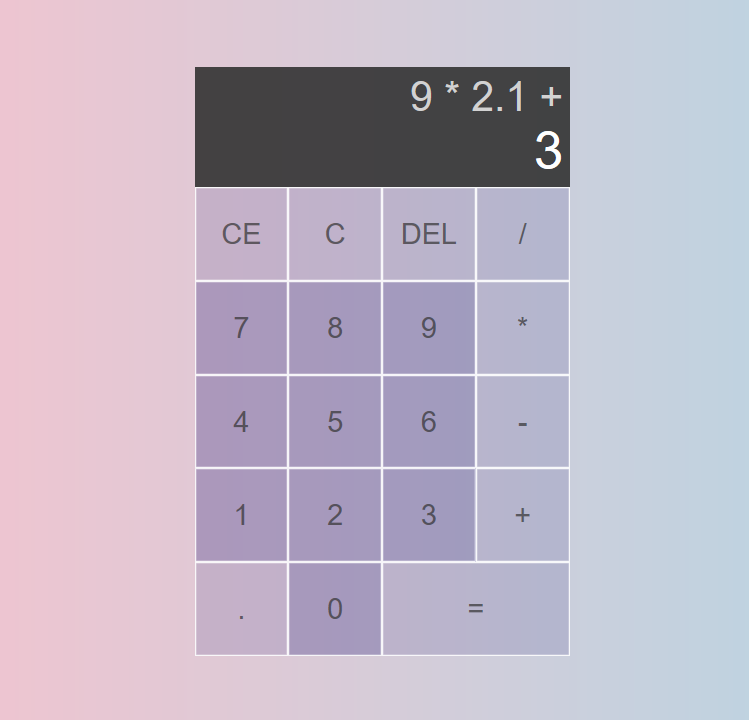

# SIMPLE CALCULATOR

Simple calculator as exercise on HTML, CSS, and JavaScript. I was following tutorial from Web Dev Simplified on his [youtube channel](https://www.youtube.com/watch?v=j59qQ7YWLxw) while trying to code my own.

#

#
